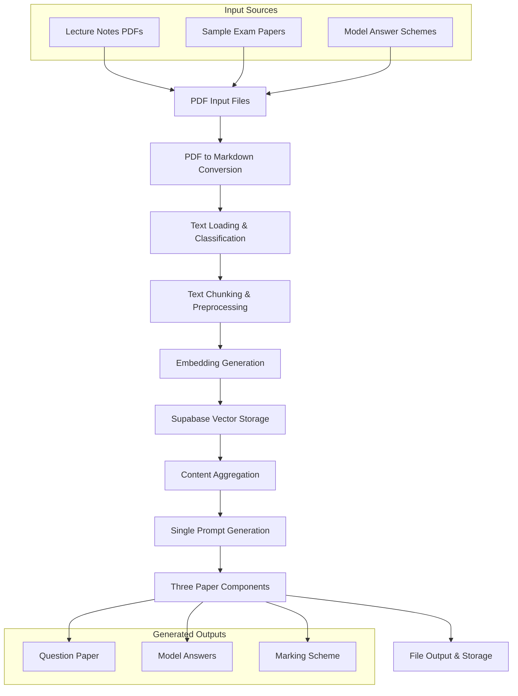

**Gemini-Powered Academic Assessment Generator**:




# Gemini-Powered Academic Assessment Generator

> **Comprehensive exam generation system using Google Gemini AI, Supabase vector storage, and advanced NLP processing**

## 🎯 Overview

This system automatically generates university-level comprehensive examinations by analyzing lecture notes and sample papers. It creates three distinct components: **Question Papers**, **Model Answers**, and **Marking Schemes** using a sophisticated AI-powered workflow.

## ✨ Key Features

- **📄 Multi-format Input**: Processes PDF lecture notes and exam papers
- **🧠 AI-Powered Generation**: Uses Gemini 2.5 Flash for intelligent content creation
- **📊 Vector Storage**: Supabase-based embedding storage with similarity search
- **🎓 Academic Standards**: Generates university-level assessments with proper formatting
- **📋 Three-Component Output**: Question paper, model answers, and marking schemes
- **🔄 Comprehensive Logging**: Detailed operation tracking and error handling
- **⚡ Duplicate Detection**: Intelligent content deduplication and processing optimization


## 🏗️ System Architecture

### Core Components

```
gemini-embedding-model/
├── 📁 config/                 # Configuration settings
├── 📁 data/
│   ├── 📁 input/              # PDF source files
│   │   ├── 📁 kelvin_papers/  # Sample exam papers
│   │   └── 📁 lectures/       # Lecture notes
│   └── 📁 output/             # Generated content
│       ├── 📁 converted_markdown/
│       ├── 📁 processed/      # Embeddings & chunks
│       ├── 📁 generated_exams/
│       └── 📁 logs/           # Comprehensive logging
├── 📁 scripts/               # Utility scripts
├── 📁 src/core/              # Core system modules
│   ├── 📁 content/           # Content aggregation
│   ├── 📁 embedding/         # AI embedding generation
│   ├── 📁 generation/        # Exam generation logic
│   ├── 📁 storage/           # Supabase integration
│   ├── 📁 text/              # Text processing
│   ├── 📁 utils/             # Logging & utilities
│   └── 📁 workflows/         # Orchestration
└── 📁 run_pipeline.py        # Main CLI interface
```


## 🚀 Quick Start

### Prerequisites

```bash
# Install Python dependencies
pip install -r requirements.txt

# Install spaCy model for text processing
python -m spacy download en_core_web_sm
```


### Environment Configuration

Create a `.env` file with your API credentials:

```env
# Gemini AI Configuration
GEMINI_API_KEY=your_gemini_api_key_here

# Supabase Configuration
SUPABASE_URL=your_supabase_url_here
SUPABASE_SERVICE_KEY=your_supabase_service_key_here
SUPABASE_ANON_KEY=your_supabase_anon_key_here

# Optional: Processing Configuration
RATE_LIMIT_RPM=15
BATCH_SIZE=10
MAX_CHUNK_SIZE=1500
CHUNK_OVERLAP=200
```


### Database Setup

```bash
# Initialize Supabase database with required tables
python scripts/setup/initialize_database.py

# Test API connections
python scripts/setup/test_api_connection.py
```


## 📋 Usage

### Option 1: Complete Pipeline (Recommended)

Generate comprehensive exams with a single command:

```bash
# Run complete workflow
python run_pipeline.py run-full-pipeline

# Or generate papers directly
python run_pipeline.py generate-comprehensive-papers --topic "AI and Data Analytics"
```


### Option 2: Step-by-Step Execution

```bash
# Step 1: Convert PDFs to Markdown
python scripts/direct_convert.py

# Step 2: Process text content
python run_pipeline.py process-texts --use-supabase

# Step 3: Generate embeddings
python run_pipeline.py generate-embeddings --use-supabase

# Step 4: Generate comprehensive exam
python run_pipeline.py generate-comprehensive-papers --topic "Your Topic"
```


### Option 3: Simplified Script

```bash
# One-command paper generation
python scripts/generate_papers.py --topic "AI and Data Analytics" --verbose
```


## 🔄 Detailed Workflow

### Phase 1: Content Ingestion

1. **PDF Processing**: Converts lecture PDFs and sample papers to markdown using `pymupdf4llm`
2. **Content Classification**: Automatically identifies lecture notes, exam questions, and model answers
3. **Text Cleaning**: Normalizes formatting while preserving academic structure

### Phase 2: Content Processing

4. **Intelligent Chunking**: Splits content into semantic chunks with overlap for context preservation
5. **Embedding Generation**: Creates vector embeddings using Gemini's `text-embedding-004` model
6. **Vector Storage**: Stores embeddings in Supabase with similarity search capabilities

### Phase 3: Content Analysis

7. **Duplicate Detection**: Identifies existing content to avoid reprocessing
8. **Content Aggregation**: Optimally combines relevant content for exam generation
9. **Context Preparation**: Prepares comprehensive context within token limits

### Phase 4: Exam Generation

10. **Single Prompt Generation**: Uses advanced academic assessment prompt with Gemini 2.5 Flash
11. **Three-Component Creation**: Generates question paper, model answers, and marking scheme
12. **Format Validation**: Ensures proper academic formatting and structure compliance

### Phase 5: Output Management

13. **Multi-format Export**: Saves as TXT, MD, and JSON formats
14. **Quality Validation**: Verifies content quality and completeness
15. **Comprehensive Logging**: Records all operations for debugging and analysis

## 📊 Generated Output Structure

### Question Paper

- University-standard formatting
- Diverse question types (conceptual, calculation, programming)
- Proper mark allocation
- Clear instructions and time limits


### Model Answers

- **Tabular format**: Question No. | Sub-part | Solutions | Marks
- Step-by-step solutions
- Complete working for calculations
- Code implementations for programming questions
- Source references to lecture materials


### Marking Scheme

- **Same detailed tabular format** as model answers
- Specific marking criteria for each component
- Partial credit guidelines
- Clear mark justification


## 🛠️ Configuration Options

### Text Processing

- `MAX_CHUNK_SIZE`: Maximum chunk size (default: 1500)
- `CHUNK_OVERLAP`: Overlap between chunks (default: 200)
- `MIN_SIMILARITY_THRESHOLD`: Minimum similarity for content matching (default: 0.3)


### AI Generation

- `EMBEDDING_MODEL`: Gemini embedding model (default: "text-embedding-004")
- `GENERATION_MODEL`: Content generation model (default: "gemini-2.5-flash")
- `RATE_LIMIT_RPM`: API requests per minute (default: 15)


### Database

- `VECTOR_DIMENSIONS`: Embedding dimensions (default: 768)
- Tables: `documents`, `text_chunks`, `embeddings`, `generated_exams`


## 📈 Monitoring and Logging

The system provides comprehensive logging across multiple dimensions:

- **Application Logs**: General operation tracking
- **API Operations**: Gemini API interactions and quota management
- **Database Operations**: Supabase transactions and performance
- **Text Processing**: Content loading and chunking operations
- **Embedding Generation**: Vector creation and storage
- **Exam Generation**: Assessment creation workflow
- **Performance Metrics**: Processing speed and resource usage

All logs are stored in `data/output/logs/` with automatic rotation and retention policies.

## 🔧 Troubleshooting

### Common Issues

**PDF Conversion Fails**

```bash
# Ensure pymupdf4llm is installed
pip install pymupdf4llm
```

**API Quota Exceeded**

- Check `data/output/logs/api_operations.log`
- Gemini free tier: 50 requests/day
- Consider API key upgrade or request batching

**Missing ContentAggregator**

- Implement `src/core/content/content_aggregator.py`
- Add `aggregate_for_single_prompt()` method

**Database Connection Issues**

```bash
# Test connections
python scripts/setup/test_api_connection.py

# Reinitialize database
python scripts/setup/initialize_database.py
```


## 🔮 Future Enhancements

- [ ] **Multi-model Support**: Integration with Claude, GPT-4, and other LLMs
- [ ] **Advanced Question Types**: Support for diagrams, code snippets, and multimedia
- [ ] **Custom Templates**: Configurable exam formats and institutional requirements
- [ ] **Batch Processing**: Multiple topic exam generation
- [ ] **Web Interface**: User-friendly GUI for non-technical users
- [ ] **Quality Metrics**: Automated assessment quality scoring
- [ ] **Content Updates**: Dynamic re-generation based on updated materials


## 📄 License

This project is designed for academic and educational use. Please ensure compliance with your institution's AI usage policies and Google Gemini API terms of service.

## 🎓 Academic Standards Compliance

This system is designed to generate assessments that meet university-level academic standards:

- **Bloom's Taxonomy Integration**: Questions spanning knowledge, comprehension, application, analysis, synthesis, and evaluation
- **Balanced Assessment**: Ensures diverse question types for comprehensive skill evaluation
- **Professional Formatting**: Follows academic institution standards for examination papers
- **Rigorous Validation**: Multiple validation layers ensure content quality and appropriateness
- **Source Attribution**: Maintains traceability to original lecture materials