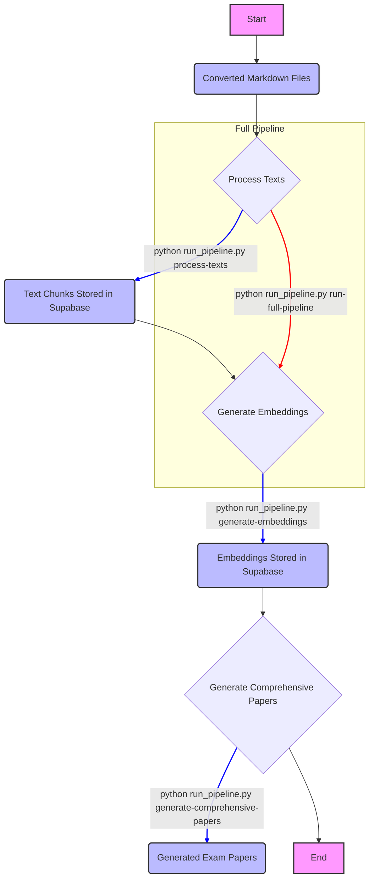

## 🎯 Overview

This system transforms raw academic content (PDFs) into structured, comprehensive exam papers through an intelligent pipeline that:

- **Converts** PDFs to structured markdown content
- **Processes** text into optimized chunks with embeddings
- **Stores** content in Supabase vector database
- **Generates** comprehensive exam papers with AI assistance
- **Creates** model answers and detailed marking schemes


## 🏗️ Architecture


```mermaid
graph TD
    A[Start] --> B(Converted Markdown Files);
    B --> C{Process Texts};
    C -- "python run_pipeline.py process-texts" --> D(Text Chunks Stored in Supabase);
    D --> E{Generate Embeddings};
    E -- "python run_pipeline.py generate-embeddings" --> F(Embeddings Stored in Supabase);
    F --> G{Generate Comprehensive Papers};
    G -- "python run_pipeline.py generate-comprehensive-papers" --> H(Generated Exam Papers);
    G --> I[End];
    subgraph Full Pipeline
        C -- "python run_pipeline.py run-full-pipeline" --> E;
    end
    style A fill:#f9f,stroke:#333,stroke-width:2px;
    style I fill:#f9f,stroke:#333,stroke-width:2px;
    style B fill:#bbf,stroke:#333,stroke-width:2px;
    style D fill:#bbf,stroke:#333,stroke-width:2px;
    style F fill:#bbf,stroke:#333,stroke-width:2px;
    style H fill:#bbf,stroke:#333,stroke-width:2px;
    linkStyle 2 stroke:#00f,stroke-width:2px;
    linkStyle 4 stroke:#00f,stroke-width:2px;
    linkStyle 6 stroke:#00f,stroke-width:2px;
    linkStyle 8 stroke:#f00,stroke-width:2px;
```


## 📦 Installation

### Prerequisites

- Python 3.8+
- Google Gemini API key
- Supabase account and project


### Setup

1. **Clone the repository**

```bash
git clone <repository-url>
cd gemini-embedding-exam-generator
```

2. **Install dependencies**

```bash
pip install -r requirements.txt
```

3. **Install spaCy model**

```bash
python -m spacy download en_core_web_sm
```

4. **Environment Configuration**

Create a `.env` file in the project root:

```env
# Gemini API Configuration
GEMINI_API_KEY=your_gemini_api_key_here
RATE_LIMIT_RPM=60

# Supabase Configuration
SUPABASE_URL=your_supabase_url
SUPABASE_SERVICE_KEY=your_service_key
SUPABASE_ANON_KEY=your_anon_key

# Processing Configuration
BATCH_SIZE=100
CHUNK_OVERLAP=200
MIN_SIMILARITY_THRESHOLD=0.3

# API Configuration
API_TIMEOUT_SECONDS=300
MAX_RETRY_ATTEMPTS=2
```

5. **Directory Structure Setup**

```bash
mkdir -p data/input/kelvin_papers
mkdir -p data/input/lectures
mkdir -p data/output
```


## 🚀 Usage

### Quick Start - Complete Pipeline

Generate comprehensive exam papers from PDFs in one command:

```bash
# Generate comprehensive papers for a specific topic
python run_pipeline.py generate-comprehensive-papers --topic "AI and Data Analytics"

# Run the complete pipeline (text processing + embeddings + generation)
python run_pipeline.py run-full-pipeline
```


### Step-by-Step Process

1. **Fetch PDFs from Vercel Blob Storage (or other URL)**

    To convert PDFs stored in Vercel Blob Storage (or any public URL) to Markdown, you can utilize the `scripts/direct_convert.py` script. Edit the `vercel_blob_files` list in the `if __name__ == "__main__":` block of this script with your PDF URLs and their categories.

    ```bash
    python scripts/direct_convert.py
    ```

    This script will download the specified PDFs to a temporary location, convert them to Markdown (prioritizing Azure Document AI if configured, otherwise using `pymupdf4llm`), and save the converted Markdown files to `data/output/converted_markdown/`.

2. **Convert PDFs to Markdown (Local Files)**

    If your PDFs are stored locally in `data/input/kelvin_papers` or `data/input/lectures`, you can convert them to Markdown:

    ```bash
    python scripts/direct_convert.py # This will convert local PDFs if `convert_all_pdfs_enhanced_from_local()` is uncommented
    ```

3. **Process Text Content**

```bash
python run_pipeline.py process-texts --use-supabase --input-dir data/output/converted_markdown
```

4. **Generate Embeddings**

```bash
python run_pipeline.py generate-embeddings --use-supabase
```

5. **Generate Comprehensive Papers**

```bash
python run_pipeline.py generate-comprehensive-papers --topic "Your Subject" --requirements-file requirements.json
```


### CLI Commands Reference

| Command | Description | Key Options |
| :-- | :-- | :-- |
| `process-texts` | Convert and process text content | `--input-dir`, `--use-supabase`, `--force-reprocess` |
| `generate-embeddings` | Create vector embeddings | `--batch-size`, `--use-supabase`, `--force-regenerate` |
| `generate-comprehensive-papers` | Generate complete exam set | `--topic`, `--requirements-file` |
| `run-full-pipeline` | Execute complete workflow | None |
| `status` | Check pipeline health | None |
| `test-supabase` | Validate database connection | None |
| `validate-content` | Validate pipeline content | None |
| `logs` | View recent logs | `--lines` |

## 📁 Project Structure

```
├── src/core/                          # Core application modules
│   ├── text/                         # Text processing
│   │   ├── text_loader.py           # Document loading and classification
│   │   └── chunker.py               # Text chunking with overlap
│   ├── embedding/                   # Embedding generation
│   │   ├── embedding_generator.py   # Batch embedding processing
│   │   ├── gemini_client.py        # Gemini API client
│   │   └── rate_limiter.py         # API rate limiting
│   ├── storage/                     # Data persistence
│   │   ├── vector_store.py         # Supabase vector operations
│   │   └── supabase_client.py      # Database client
│   ├── generation/                  # Content generation
│   │   └── single_prompt_generator.py # Exam generation logic
│   ├── content/                     # Content processing
│   │   └── content_aggregator.py    # Content optimization
│   ├── workflows/                   # Pipeline workflows
│   │   └── single_prompt_workflow.py # End-to-end workflow
│   └── utils/                       # Utilities
│       ├── logging_config.py       # Comprehensive logging
│       ├── content_validator.py    # Content validation
│       └── process_lock.py         # Process synchronization
├── scripts/                         # Utility scripts
│   └── direct_convert.py           # PDF to Markdown conversion
├── config/                          # Configuration
│   └── settings.py                 # Application settings
├── data/                           # Data directories
│   ├── input/                      # Raw input files
│   ├── output/                     # Processed outputs
│   └── logs/                       # Application logs
└── run_pipeline.py                 # Main CLI interface
```


## 🔧 Configuration

### Gemini API Setup

1. Get your API key from [Google AI Studio](https://makersuite.google.com/app/apikey)
2. Add to `.env` file
3. Configure rate limits (default: 10 RPM for free tier)

### Supabase Database Schema

The system requires these tables in Supabase:

```sql
-- Documents table
CREATE TABLE documents (
  id BIGINT PRIMARY KEY GENERATED ALWAYS AS IDENTITY,
  title TEXT NOT NULL,
  content TEXT NOT NULL,
  source_file TEXT NOT NULL,
  paper_set TEXT,
  paper_number TEXT,
  metadata JSONB DEFAULT '{}',
  created_at TIMESTAMPTZ DEFAULT NOW()
);

-- Text chunks table
CREATE TABLE text_chunks (
  id BIGINT PRIMARY KEY GENERATED ALWAYS AS IDENTITY,
  document_id BIGINT REFERENCES documents(id),
  chunk_text TEXT NOT NULL,
  chunk_index INTEGER,
  chunk_size INTEGER,
  overlap_size INTEGER DEFAULT 0,
  metadata JSONB DEFAULT '{}',
  created_at TIMESTAMPTZ DEFAULT NOW()
);

-- Embeddings table
CREATE TABLE embeddings (
  id BIGINT PRIMARY KEY GENERATED ALWAYS AS IDENTITY,
  chunk_id BIGINT REFERENCES text_chunks(id),
  embedding VECTOR(768),
  model_name TEXT DEFAULT 'text-embedding-004',
  created_at TIMESTAMPTZ DEFAULT NOW()
);

-- Generated exams table
CREATE TABLE generated_exams (
  id BIGINT PRIMARY KEY GENERATED ALWAYS AS IDENTITY,
  title TEXT NOT NULL,
  exam_json JSONB NOT NULL,
  topic TEXT,
  difficulty TEXT DEFAULT 'standard',
  total_marks INTEGER,
  total_questions INTEGER,
  created_at TIMESTAMPTZ DEFAULT NOW()
);
```


## 📊 Features

### Content Processing

- **Multi-format PDF conversion** with fallback methods (PyMuPDF, pdfplumber, pdfminer)
- **Intelligent text chunking** with configurable overlap
- **Content classification** (lecture notes, exam papers, model answers)
- **Image extraction** from PDFs with automatic organization


### Embedding Generation

- **Batch processing** with intelligent rate limiting
- **Duplicate detection** to avoid reprocessing
- **Error recovery** with comprehensive logging
- **Quota management** for API efficiency


### Exam Generation

- **Comprehensive academic assessments** with 3 components:
    - Question papers with proper formatting
    - Detailed model answers in tabular format
    - Marking schemes with criteria and partial credit
- **Quality validation** with academic standards checking
- **Multiple output formats** (PDF, Markdown, JSON, TXT)


### Vector Search

- **Similarity-based content retrieval**
- **Metadata filtering** by paper sets and content types
- **Relevance scoring** with configurable thresholds


## 🔍 Monitoring \& Debugging

### Health Checks

```bash
# Check overall system status
python run_pipeline.py status

# Test Supabase connectivity
python run_pipeline.py test-supabase

# Validate content pipeline
python run_pipeline.py validate-content
```


### Logging

- **Comprehensive logging** to `data/output/logs/`
- **Operation-specific logs** for debugging
- **Performance monitoring** with timing metrics
- **Error tracking** with context preservation


### Troubleshooting

**Common Issues:**

1. **Embeddings not in Supabase**
    - Check `.env` configuration
    - Verify Supabase schema
    - Run `python run_pipeline.py test-supabase`
2. **API Rate Limiting**
    - Adjust `RATE_LIMIT_RPM` in `.env` (default is 60 RPM).
    - Adjust `BATCH_SIZE` in `.env` (default is 100). 
    - If issues persist, consider reducing these values.
    - Check daily quota usage for your Gemini API key.
3. **PDF Conversion Failures**
    - Install missing dependencies
    - Check file permissions
    - Verify PDF file integrity
4. **Generation Timeouts**
    - Reduce content size in aggregator
    - Adjust `API_TIMEOUT_SECONDS`
    - Use progressive content reduction